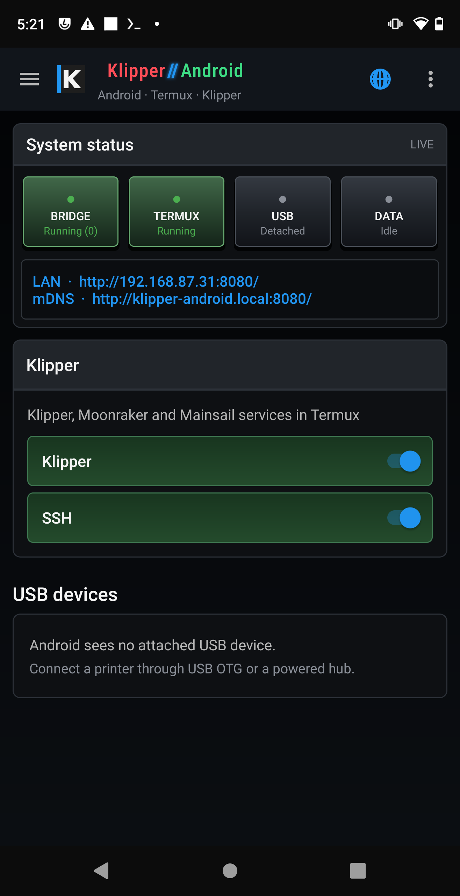
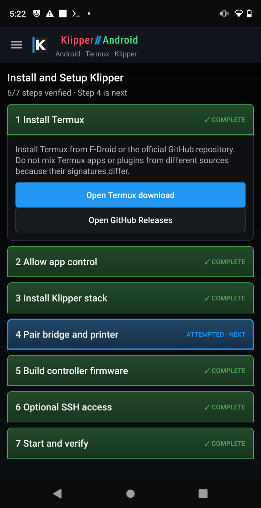
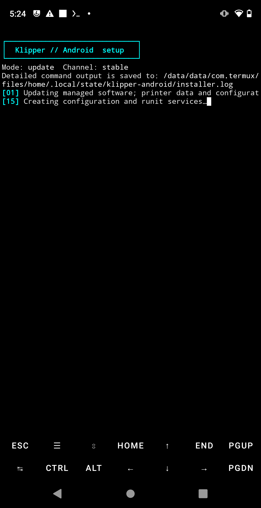
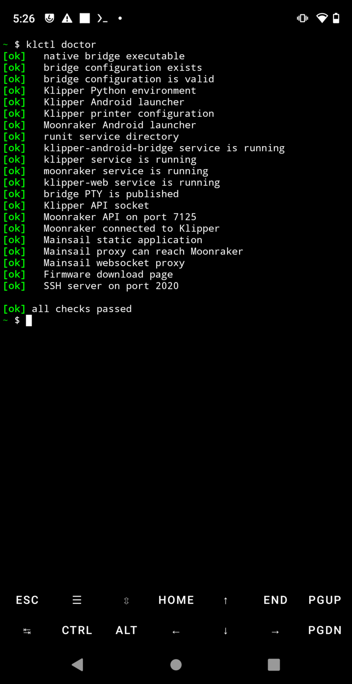

<p align="center">
  
</p>

Runs mainline Klipper, Moonraker, and Mainsail on **_not-rooted_** Android phones with Termux. Klipper does require one small patch to work around legacy Android kernel clock issues. The Android app supplies the Termux-to-USB serial bridge and guided setup, update, status, SSH, Mainsail, and firmware tools.

```text
Klipper ↔ PTY ↔ native C bridge ↔ loopback TCP ↔ Android USB service ↔ printer MCU
```

- Guided installation and incremental updates for Klipper, Moonraker, Mainsail, nginx, and supervised Termux services.
- Low-overhead native serial forwarding with an authenticated binary handshake and raw pass-through afterward.
- USB CDC-ACM, CH340/CH341, CP210x, FTDI, and PL2303 support through [`usb-serial-for-android`](https://github.com/mik3y/usb-serial-for-android).
- A Mainsail WebView, live bridge/service status, optional SSH on port 2020, and LAN/mDNS addresses.
- Termux-native firmware profiles for common BTT/Voron boards, incremental builds, SD export, and browser downloads at `/firmware/`.

## On the phone

<table>
  <tr>
    <td align="center"><strong>Dashboard</strong><br></td>
    <td align="center"><strong>Guided setup</strong><br></td>
  </tr>
  <tr>
    <td align="center"><strong>One-tap update</strong><br></td>
    <td align="center"><strong>Health check</strong><br></td>
  </tr>
</table>

## Quick start

1. Install Termux from [F-Droid](https://f-droid.org/packages/com.termux/) or its [official GitHub releases](https://github.com/termux/termux-app/releases). Do not mix Termux apps or plugins from different sources—their signatures differ.
2. Install the Klipper For Android APK from this project's [Releases](https://github.com/thingsapart/klipper_termux/releases).
3. Open **Settings → Install and Setup Klipper** and follow the checklist. The app launches the installer in Termux and explains the one Android setting needed for external commands.
4. Connect the printer controller through USB OTG (a powered hub is preferable) and grant the app USB access.

Mainsail is then available at `http://PHONE_IP:8080/`. `klctl start`, `klctl stop`, and `klctl doctor` provide the same basic controls from Termux.

The app and prebuilt APK do not need Android Studio. Building the APK needs JDK 17–21, Android SDK command-line tools for API 35, and `adb` for device upload:

```sh
scripts/build-app.sh
scripts/build-and-upload-app.sh [--serial DEVICE_SERIAL]
```

Native bridge and installer checks:

```sh
cmake -S . -B build -G Ninja -DBUILD_TESTING=ON
cmake --build build
ctest --test-dir build --output-on-failure
tests/installer/test_installer.sh
```

See [INSTALL.md](docs/INSTALL.md) for the complete phone workflow and [PROTOCOL.md](docs/PROTOCOL.md) for the bridge wire format.

Treat the phone, USB link, and host software as control infrastructure—not a safety system. Supervise initial hardware tests and keep the printer's independent thermal protections enabled.
